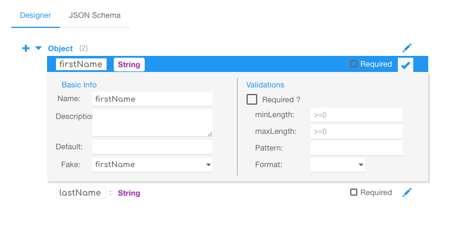
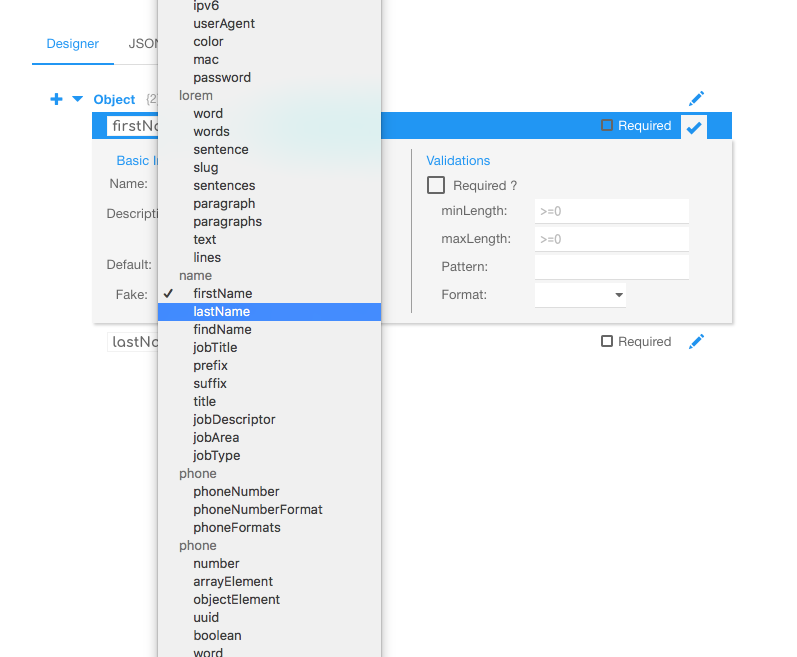
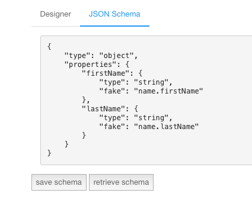

# JSON Schema Builder
A simple GUI tool to enable designing and building JSON schemas

## Example
You can see a working version of this at [JSON Schema Builder](https://bjdash.github.io/JSON-Schema-Builder/)

## added fake property to enable fake data generation

## added buttons to load and save schema

